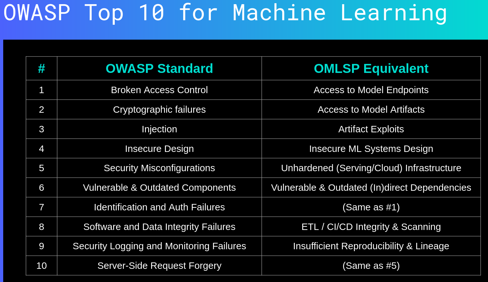

## Python security discussions

### [Secure Python ML -- The Major Security Flaws in the ML Lifecycle (and how to avoid them)](https://ep2022.europython.eu/session/secure-python-ml-the-major-security-flaws-in-the-ml-lifecycle-and-how-to-avoid-them) (Alejandro Saucedo) (MP/LK)

[Slides](bit.ly/secureml)
[Example code and demo](https://github.com/EthicalML/fml-security)

In contrast to areas such as devops where security is strictly defined and practiced, the machine learning pipeline still struggles to define the key foundations to have for keeping the algorithm within a secure framework. What are the best security practices for such algorithms?
The problem is that we keep the “normal” security principles from developing software, while adding more complexity through machine learning algorithms without considering the extended security threats that might come with it.
Complex data flow
components that might affect up the stream or down the stream
reproducibility of the components 
“Every single stage in the classic (scikit) machine learning production is a security risk”.

- Security challenges in devops and software space more known, actively explored, alot of resources around them
- Key challenges in ML still being defined as best practice
- Impossible to make systems unhackable, but possible to mitigate undesired outcomes
- Solutions will be technical in nature but will ultimately still rely on humans and processes

#### MLSecOps
DevOps + SecOps + MLOps
Extension of Devops and
Security with focus on ML

#### Why is production ML so challenging?
- Specialized hardware
- Scheduling
- Large amount of memory
- Complex data flows (relations)
- Compliance
- Reproducibility of components (non-determinism)

#### The lifecycle of the model really starts when the model is deployed

#### Security risk areas:

- Loading Model Artifacts
  - \_\_reduce\_\_ problem
  - Torch and TF use pickle internally (problem!)
  - Need to be able to trust the location and pipelines which generate these serializations.
- Access to model
  - Adversarial ML can exploit models
  - arxiv 2012.07805 (Extracting Training Data from Large Language Models)
- Dependencies
  - `pipdeptree`
  - `safety`
  - `poetry`
- Code Vulnerabilities
  - Codescan tools
  - keras vulnerability!
  - `bandit`
- Model / Runtime images
  - Image scans
  - `trivy`
- Honorable mentions

Corresponding OWASP (Open Web Application Security Project) Top 10 for ML:
- Access to Model ENdpoints
- Access to Model Artifacts
- Artifact Exploits
- Insecure ML Systems Design
-  Unhardened (Serving/Cloud) Infrastructure
- Vulnerable & Outdated (in)direct Dependencies
- (Same as #1)
- ETL / CI/CD Integrity & Scanning
- Insufficient Reproducibility & Lineage
- (Same as # 5)

#### General guidelines
OWASP (Open Web Application Security Project) equivalent:
OMLSP (Open Machine Learning Security Project?)

### [Writing secure code in Python](https://ep2022.europython.eu/session/writing-secure-code-in-python) (Yan Orestes) (MP)

#### Don't use `eval`!
- If adding {} as second argument to eval, clears global variables.
- If we add {"\_\_builtins\_\_":{}} we also clear the builtins that python imports
- But this can still be rounded! Check [netsec.expert](netsec.expert)
- Alternatives:
  - ast.literal\_eval
  - Can evaluate strings/literals, but won't execute
- When use eval? Never.

### [Packaging security with Nix](https://ep2022.europython.eu/session/packaging-security-with-nix) (Ryan Lahfa) (MP)

A package is a tree of files with a \_\_init\_\_.py in its root folder.

You can import it with import if you are under he right conditions.

...

A user manually install packages. There are valuable targets on our local computers (source code, SSH keys, personal files, professional files, secrets).

...

~/.ssh, /config, ~/.bash_history , ~/.config/Firefox{...}

...

You publish a package to PyPI by writing down instructions to use the package and perform some operations.

A package is installed by using setup.py. Shipped and then run at install-time on some arbitrary user.

Example: `dateutil`
Python 2 - Python 3 transition was painful, so some packages were named package-Python3. Dateutil didn't have such a version, but a malicious variant was created and named dateutil-Python3.

2 march 2021 PyPI nuked 3600 malicious packages
dppclient had >= 10k downloads!
PyPI rolled out mandatory 2FA for critical packages

Why must we have arbitrary code execution during installation?
Because there is no alternative. (?)

...

What is Nix?

A general package manager which works with other package managers, based on the functional Nix language.

A Nix path consists of a cryptographic hash.
/nix/store/{hash}-python3-package-name/env/...

...

Why??

- Build reproducibility as a goal
- Build operations are sandboxed by default: no nework access, no arbitrary access to the user filesystem or even "installed" dependencies, only what is declared, software cannot phone home!
- Strict and well-disciplined
- Composition with local package managers: painful but leveraging existing tooling is key to nixpkgs size
- Trivial caching: by reproducibility, we only build software more or less once and Nix does aggressive (valid) caching.

...

How use Nix as a tool?

Nix is very strict and the world outside is quite forgiving, hence:

- Reuse existing tooling like pip or poetry without giving them network access, neither arbitrary filesystem access or cache access.
- ...

- Can use Nix with shebangs in a script!
- Nix shell kind of works like an venv?

### [CPython bugs & risky features](https://ep2022.europython.eu/session/cpython-bugs-risky-features) ([disconnect3d](https://disconnect3d.pl/about/)) (MP)

- When invoking python interpreter the libreadline.so, _json.so & other *.so files are loaded and may execute any payload added to those files
  - Could happen e.g. if you execute Python interpreter in a downloads directory of your webapp
  - Or if you execute Python *interpreter* as a subprocess programmatically (who does that?)

  - Upcoming fix in python 3.11
- Installed packages may also execute payloads on each Python startup via .pth (path configuration) files
  - From docs on pth: “Lines starting with `import` (followed by space or tab) are _executed_ (with `exec`). … An executable line in a .pth file is run at every Python startup, regardless of whether a particular module is actually going to be used. 
  - isolate mode helps for both of these cases (-I) (may restrict some use perhaps?)
  - this isolates Python from the user’s environment (implies -E (ignore PYTHON* environment variables) and -S (don’t imply ‘import site’ on initialization))
  - These packages use this bug as a feature and may be susceptible:
    - pytest-cov
    - manhole
    - hunter
    - future_fstrings

- socket.inet_aton uses libc function and glibc implementation is "weird" (can write illegal ips)
  - socket.inet_aton('1.1.1.1 ; oh wow') gives no error -> oh no!
  - same with ssl.match_hostname (although this function is not really used anymore)
  - the requests module util functions also have this bug
- don’t use crypt.crypt(pwd) (on mac or x-platform)
  - use hashlib instead

- package.method? -> gives help

Check the last slide [here](https://ujeb.se/pybugs) for a nice summary!

### Tales of python security (LK)
A talk that described a short history of a microsoft/python security response team with their experiences, together with some discussion on how to understand security breaches when it comes to dependencies that are installed through PyPI.

Microsoft Security response team in collaboration with python security response team.
If you have any security concerns regarding python this team is the one to contact and report to: https://www.python.org/dev/security/ 
They happily receive reports for potential issues.
If you double check the name and version of the package you are trying to install, you run a very small risk of actually being targeted by malicious code.
A previous risk was installing a package with a higher version on the package that exists officially (private package). Bom, you got hacked!
Does not seem to be a general problem, unless you’re installing private packages using pip.
Again, using a dependency check seems to be useful to avoid these kinds of issues. Such a python poetry: https://python-poetry.org/

### [Work in Progress: Implementing PEP 458 to Secure PyPI downloads](https://ep2022.europython.eu/session/work-in-progress-implementing-pep-458-to-secure-pypi-downloads)

A talk by a team that is working on a more sophisticated version of PyPI security, namely PEP 458 (python enhancement proposal).
-Package distribution
The package distribution software (pip) is actively being targeted by hacking attempts. The packages need to be protected. Since we have a huge series of dependencies between packages, you cannot solely rely on that one of them can be since they have dependencies themselves. That is, the scale of the python package distribution is the problem. We cannot trust each signature of a package in this large network.

-TUF (The Update Framework)
TL;DR: This talk is about a hopeful future update to the security standards of PyPI package handling, to avoid malicious attempts. There is close to no practical information here, mostly discussion on design patterns. While this looks very promising, it is not relevant for work 
now. 
The proposal: https://peps.python.org/pep-0458/

One can keep track on the development here: https://github.com/pypi/warehouse/pull/10870

“We need to protect freshness, consistency and integrity” (very vague)
Delegate trust at scale
Reduce impact of compromise
Allow in-band recovery, meaning what?
This proposed framework includes different roles within the repository that are designed to keep the security standard high.

-Warehouse
Warehouse is the software that power PyPI
This is where the download of “pip install” is directed. Hosts over 380k projects.

-PEP 458
What is the proposal?
Minimize the TUF framework
Make storage and transport security non-critical
Rollback/Freeze protection
In-band explicit revocation
Limits online key compromise through implicit revocation
No change is user workflow is the aim.

How to design TUF:
Root role, assign keys and thresholds.
Targets role, package intregrity
Snapshot role, metadata consistency
Timestamp role, metadata freshness

