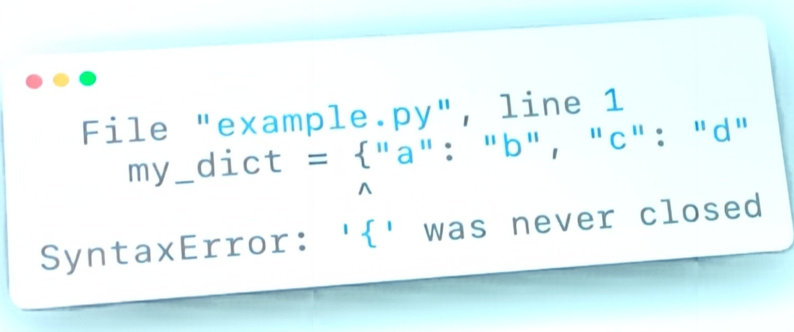

## Softwaare development and python functionality

### [The Design of Everyday APIs](https://ep2022.europython.eu/session/the-design-of-everyday-apis) (Lynn Root, Spotify) (MP)

A __masterclass__ in making a user friendly API!

[Slides](rogue.ly/apis)
Highly recommended to watch on [Youtube](https://youtu.be/x3-I2j4zSHI?t=487)!

The two most important characteristics of good design are _discoverability_ and _understanding_ – Don Norman, The Design of Everyday Things

#### Discoverability
- The 5 key elements of discoverability
  - Affordances
  - Signifiers
  - Constraints
  - Mappings
  - Feedback

#### Understability
- Can the user figure out how to use this?
- Designers expect users conceptual model to be the same as the user's. Not true!

(Example of bad API: ffmpeg (try ffmpeg –help))

#### Key elements of good API design.
1. _Inutitive_ (for the user)
   1. Use domain nomenclature
      1. User should be able to be lazy and make suggestions
      2. No surprises
      3. The nouns can be removed in method names (it should be obvious from the first argument)
   2. "Clumsy naming hints at clumsy abstractions"
      1. Don’t be afraid to divide class into multiple classes
      2. Can be confusing if a class does _too much_
   3. Providy symmetry in the available methods (create/delete/update, get/set, upload/download).
2. Flexible (for the given use case)
   1. "Lets you do what you want"
   2. Provide sane defaults to the most common use cases
      1. Make optional arguments into default args
      2. Less positional arguments (good thing to reduce!)
      3. Type hints with too many arguments... reduce! _Reveals too much complexity_
   3. Minimize user repetition!
      1. Accept multiple inputs (using *args) instead of user having to use loops
   4. Be predictable and precise
      1. Clear constraint in what we return from each method (not -> All or -> Int | None)!
      2. Perhaps raise an error instead of returning none when finished (Feedback - discoverability!)
   5. Let users be lazy!    
    1. __Don’t force users to provide data that you can generate yourself!__
    2. None or something ?? = if None this else that (!)
          3. give a nice \_\_repr\_\_!
          4. use [__@dataclass__](https://docs.python.org/3/library/dataclasses.html) or [__attrs__](https://www.attrs.org/en/stable/) (packages to make class creation easy! I recommend you look these up!)

3. Simple
   1. Provide composable functions
      1. Mathematical closure property
      2. Every op. returns a datatype which can be fed into another op.
      3. Example str() op
      4. pull() gives msg -> ack(msg) instead of ack(msg.id) (do it for the user)
   2. Leverage language idioms
      1. Provide an iterator! or other simple type
      2. Provide a context manager! (eases cognitive load)
   3. Provide convenience
      1. "How much do I need to learn to use this library?"
      2. __write the readme like a newspaper!__
      3. __At the top__ of the readme!:
         1. How do I install?
         2. How do I get started? Simple example in plain code! (copy-paste-able)
         3. Where do I go for more info? Docs, blog etc.

### [Making Python better one error message at a time](https://ep2022.europython.eu/session/making-python-better-one-error-message-at-a-time) (LK)
#### Fixing the confusing syntax-errors!
This talk highlighted unforgivable errors of the current, and original, python error parser. However, in the strategic contrast he presented the new PEG parser for CPython that captures such errors with very high precision. It is supposed to be launched in python 3.11.
It seems to be somewhat usable already, giving you way more information when  handling errors. However, he did warn of bugs. There is apparently a lot to cover and the logic behind each case of error might not be water-proof yet.
Example of what the improved version looks like:

For those who don't know, earlier this error would have produced a syntax-error at the next coming lines, probably pointing at a part of the code that is totally syntax legal. big improvement!

Docs:
https://peps.python.org/pep-0617/

new PEG Parser, replacing the old LL(1) parser.
Under development. Only available for python 3.10 (or 3.11?)

### [Python Objects Under the Hood](https://ep2022.europython.eu/session/python-objects-under-the-hood) (Rodrigo Girão Serrão) (MP)

A talk based on an earlier [blogpost](https://mathspp.com/blog/pydonts/dunder-methods) by the talker/author.

The talk covered dunder methods – i.e. methods such as \_\_init\_\_, \_\_len\_\_, \_\_iter\_\_ etc. These methods may seem magic, but they are just called implicitly. They may also be called explicitly, but that kind of defeats their purpose.

Takeaway:
Dunder methods are cool and practical to know about and how to use. Especially when customizing various classes.

#### Part 1
- \_\_repr\_\_ prints the "visual representation" of the class instance.
     - Like "Point(2,3)", while \_\_str\_\_ decides what gets returned by the str() function.
- \_\_str\_\_ falls back to \_\_repr\_\_
- objects inside containers (lists/dicts) show \_\_repr\_\_
- \_\_hash\_\_ makes something hashable!
- to index into objects (\_\_getitem\_\_/\_\_setitem\_\_/\_\_delitem\_\_)
- to make a context manager : \_\_entry\_\_ / \_\_exit\_\_
- etc etc!
Difference between NotImplemented and NotImplementedError:
- _NotImplemented_ is a _"singleton"_ returned by python objects when a dunder method is missing. This asks Python to try the reversed dunder method in the other object.
    - Example:
    - a is an int
    - b is of some custom class, Cust, which has the __add__ method implemented
    - so b + a (which implicitly calls b.__add__(a)) works fine, because in __add__ we have defined how our custom class handles addition with ints
    - however, if we instead do a + b, we will get a TypeError (unsupported operand type(s)), because the int class does not know how to do addition with objects of Cust class.
    - if we would have implemented __radd__ (reverse add), this method would have been called in the a + b case. This is because, implicitly, when the int class fails to add the Cust object, it internally returns the NotImplemented singleton, which triggers Python to check if the Cust object has a __radd__ class implemented. If it does, it will use that method, with itself (or its own value) as the argument. So if __radd__ exists and is correctly implemented, then it should hold that a.__add__(b) == b.__radd__(a).
- Observe that this should only be true if a and b are commutative objects!
- NotImplementedError is an exception used anywhere when some code is not implemented yet.
- There is an exception to when the reverse method is called:
- type(y) != type(x) and issubclass(y,x)

- What is \_\_new\_\_ and why is it needed? Isn’t \_\_init\_\_ enough?
- Tuples are immutable
- \_\_init\_\_ initialises/customises objects
- tuples are objects
- \_\_init\_\_ initialises/customises tuples
- but t.\_\_init\_\_(args) does not update t
- ergo we need something that allows us to inherit from immutable objects!
- New accepts the class and the same arguments as \_\_init\_\_
- refer to super to create the new object
- return the new object in \_\_new\_\_
- Can be used to return more specific class types ("Hijacking")

Everything inherits from 'object'. That's why everything has the \_\_init\_\_ method!
- Iterable:
    - Object implementing \_\_iter\_\_ method

- Iterator:
  - Implements the \_\_iter\_\_ _and_ the \_\_next\_\_ method
  - Iterator is idemptotent:
    - iterator on iterator does nothing: 
    - it=iterator(range(10)); it is iter(it)

### [Protocols in Python: Why You Need Them](https://ep2022.europython.eu/session/protocols-in-python-why-you-need-them) (Rogier van der Geer) (MP)
Data Charmer @ GoDataDriven

#### Dynamic / Static typing
- Python is a _dynamically typed_ language:
  - Types are checked at runtime
  - Type declarations not required
  - A.k.a "duck typing" - if it has all the required attributes, it passes the check.
    - (“If it walks like a duck and it quacks like a duck, it must be a duck”)
  - Very flexible!
- Static typing (like java or C)
  - Types checked at compile time
  - Type declarations required
  - Less flexible but won’t let you run code with bad typing
  
#### Type Hints
- Introduced in 3.5
- Used to give hints – the python interpreter doesn’t check that the hints are correct and no errors are thrown!
- But can be checked using an optional static type checker like _Mypy_...

- def feed_bread(_animal: Union[Duck, Pig]_)
    - _Either_ Duck or Pig expected
- We cannot adapt type hints of imported code :(

#### ABCs (Abstract Base Classes)
- Classes that you can inherit from, but cannot instantiate
- Has @abstractmethod (needs implementation by subclass)
- Inheriting from ABCs makes isinstance(instance, ParentClass) true.
- "ABC's not easily exposed" -> hard to import ABC class
- Can register a class as a subclass of an ABC(!) (_"virtual subclass"_)
  - EatsBread.register(Mees)
  - Technically possible, but virtual subclassing can be sketchy if combining classes from multiple libraries.

#### Protocols
- "Structural subtyping" or "Static duck typing"
- Solves above issue
- Special case of ABC
- Automatically implicitly considered to be a subtype of the class inheriting from Protocol since it implements the same methods
- E.g.: Iterable, Iterator and Sized are Protocols, since they only require some dunder methods to be implemented! (\_\_next\_\_, \_\_iter\_\_ and \_\_len\_\_)
- Can add @runtime_checkable to make the protocol runtime-checkable!
  - Although it only checks signatures, not that arguments (number of, or keywords) are correct.
  
  
  ### [Lessons learnt from building my own library](https://ep2022.europython.eu/session/lessons-learnt-from-building-my-own-library) (Stephanos) (MP)

There are different types of python projects (library, server, cli) <- rough categorisation

Publishing a library to Pypy:
Audience bigger and unknown
People may use a bug as a feature! (and may start depending on it)

Building the API:
Provide sane defaults, allow customization
Plan ahead
Mark methods/modules as private with a leading underscore
Provide an __all__ list in the __init__.py
Use the __init__.py to expose an interface

- Ideally support all python versions that are officially supported
- Use a tool like tox, or something else to test in various versions
- Begin with v 0.1.0 (semantic or calendar versioning)
    - Calendar versioning may be relevant when content is date-dependent (currencies, country codes etc)
 
Dependencies
- Be as permissive as possible
- Minimise dependencies and favour standard lib
- poetry? tool for managing dependencies

Project structure
- Consider having separate dirs for src/test/docs
- Document as much as possible
- Include a README, a CHANGELOG and LICENSE (consider LGPL) (if expect to be used corporately)

Don’t delete published versions
Test on testpypi (nice sandbox)
Be permissive
Update fast (keep up with the latest Python version)
Keep up with the latest versions

### [Automate cleaning code in few easy steps!](https://ep2022.europython.eu/session/automate-cleaning-code-in-few-easy-steps) (MP)

pip install pre-commit
?
pre-commit sample-config > .pre-commit-config.yaml
pre-commit install

Check various hooks! (black, isort, autoflake, pyupgrade, flakes-eradicate)
hooks:
id: detect-aws-credentials
id: detect-private-key
id: black
id: isort
…

some hooks are slow: mypy, pylint
these can be skipped 
SKIP=flake8 git commit -m “foo”
git commit -m “skip” –no-verify

Can remove makefiles?

Poetry package manager:
packaging, dependency management.

pyproject.toml replaces setup.py, requirements.txt, config.cfg, MANIFEST.in and Pipfile

Check jttps://python-poetry.org

Poetry.lock gives EVERY dependency. toml file only gives primary dependencies.

