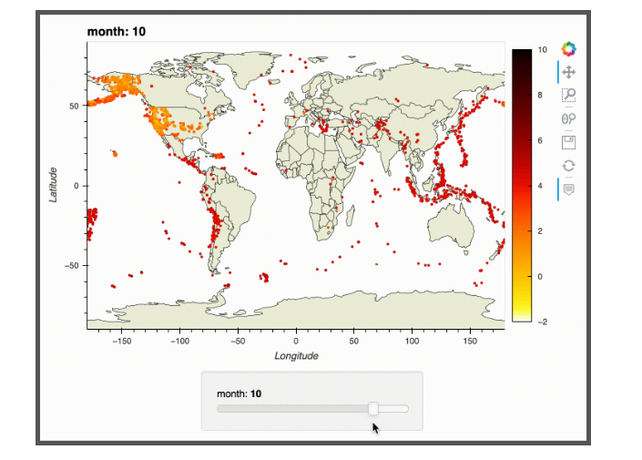

## Visualization guides

### [Create machine learning tool demos in Python!](https://ep2022.europython.eu/session/how-to-craft-awesome-machine-learning-demos-with-python) (LK)
pip install gradio, now! This handy package gets you to show-off to your colleagues with your new cutting edge ML model with just a few lines of code and some clicks.
Gradio offers really easy to understand code to create simple but useful UIs to create demos for machine learning models. Created by the team of huggignface. 
Can be hosted for free on hugginspace's website!
Of ocurse can also be run locally with just as neat-looking results.
Below is an example image, generated from a text-prompt on [crayion.com](https://www.craiyon.com/), where they use the gradio package to show of the image rendering ML models:

A flying tank, state of the art areial technology.

[gradios website](https://gradio.app/)

### [Data Visualization, beyond the basics](https://ep2022.europython.eu/session/beyond-the-basics-data-visualization-in-python) (LK)
Art of data visualization could be the key to get an important point across. This workshop started with the basics of matplotlib and its underlying structure of figures and axis usage while ending at animated plots as well as interactive panels on top of the plots. Great notebooks to refresh/and or learn more about matplotlib, especially why the object-approach to the plotting is more effective and flexible.
The authors’ notebook is available in the public git below, having three main notebooks consisting of
matplotlib.pyplot basics plus tips and tricks.
Notebook number two guides you to animate plot your. Especially effective for long time-series data where the proportions of the different data types gives essential information for different time steps
Interactive panels using the module HoloViz.

Sneak peak of an interactive plot:

[Link to data visualization workshop](https://github.com/stefmolin/python-data-viz-workshop)

### [Use animated charts to present & share your findings with ipyvizzu](https://ep2022.europython.eu/session/use-animated-charts-to-present-share-your-findings-with-ipyvizzu) (MP)

Main message: Now easier to present animated charts and graphs
The animation keeps the context

Focus on transitioning between types of graphs for the same data

Changes over time, zooming

Issues with data scienteists delivering insights to business stakeholders:
32% of time is spent with reporting and presentation
53% say business decisions are based on their insights
64% of them say that management have trouble understanding the stories they tell
Source: anaconda

jupyter and python support since march 2022 

can hover over data points

new update yesterday - presets and two-way compatibility

Everything is done locally (nothing towards a cloud)!

[vizzuhq](https://github.com/vizzuhq)
[ipyvizzu](https://github.com/vizzuhq/ipyvizzu)
[ipyvizzu-story](https://github.com/vizzuhq/ipyvizzu-story) <- for presentations (two-way)
[Examples](https://www.reddit.com/user/VizzuHQ/)

Can also make dashboards and combine charts

### Sponsors:
sourcery VSC extention
